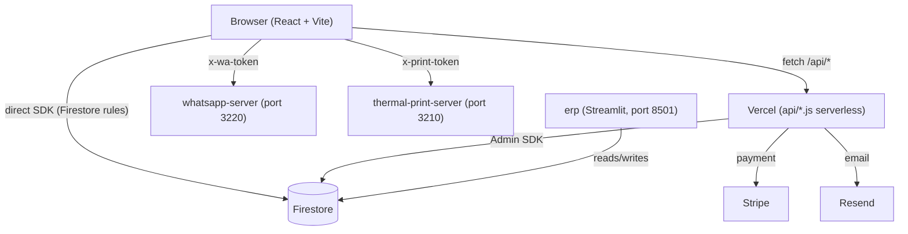

# NikkeyBox

Online store (React + Vite) with a serverless API on Vercel, Firebase (Firestore/Auth/Storage), and three optional local services: WhatsApp, thermal printing, and a Streamlit-based ERP.

## Stack

- [Vite](https://vite.dev) + [React](https://react.dev) + TypeScript
- [Tailwind CSS](https://tailwindcss.com) + [shadcn-ui](https://ui.shadcn.com)
- [Firebase](https://firebase.google.com) (Firestore, Auth, Storage)
- [Stripe](https://stripe.com) (payments)
- Vercel serverless functions in `api/`

## Project structure



- `src/` — the site (React + Vite + TypeScript)
- `api/` — Vercel serverless functions (payment, email, admin, webhooks)
- `shared/` — business logic used by both the site and the API (pricing, tax disclosure, loyalty points, feature flags)
- `scripts/` — maintenance scripts (e.g. Firestore rules history)
- `public/` — static assets
- `whatsapp-server/`, `thermal-print-server/`, `erp/` — optional local services, see **Local services** below

## Running locally

```bash
npm install
npm run dev
```

| Script | Command | What it does |
|---|---|---|
| `npm run dev` | `vite` | Site at `http://localhost:8080` (port configurable via `PORT`) |
| `npm run build` | `vite build` | Production build |
| `npm run build:dev` | `vite build --mode development` | Build in development mode |
| `npm run lint` | `eslint .` | Lint |
| `npm run typecheck` | `tsc --noEmit -p tsconfig.app.json` | Type-check without emitting files |
| `npm run test` | `vitest run` | Run tests once |
| `npm run test:watch` | `vitest` | Tests in watch mode |
| `npm run preview` | `vite preview` | Serve the production build locally |
| `npm run tunnel` | `iniciar_whatsapp_tunnel.bat` | Starts `erp/whatsapp-service` + an ngrok tunnel on port 3001 (Windows) |
| `npm run tunnel:site` | `iniciar_site_tunnel.bat` | Starts `npm run dev` + an ngrok tunnel on port 8080 (Windows) |

The site still loads without a `.env.local`: set `VITE_DISABLE_FIREBASE=true` (or `VITE_ALLOW_LOCAL_ONLY=true`) to run it without Firebase.

## Local services

| Service | Port | Doc |
|---|---|---|
| `whatsapp-server/` | 3220 | [whatsapp-server/README.md](./whatsapp-server/README.md) |
| `thermal-print-server/` | 3210 | [thermal-print-server/README.md](./thermal-print-server/README.md) |
| `erp/` (Streamlit) | 8501 | [erp/README.md](./erp/README.md) |
| `erp/whatsapp-service/` | 3001 | Documented inside [erp/README.md](./erp/README.md) (no authentication) |

## Environment variables

Names and purpose only (no values). `.env.example` also lists Google OAuth, Facebook, AWS S3, SendGrid, Slack, the official WhatsApp Business API, and feature-flag sections — none of them are read by any code in the project; they are Lovable's default template, never adapted.

| Category | Variables | Where / what for |
|---|---|---|
| Payments (Stripe) | `STRIPE_SECRET_KEY`, `STRIPE_WEBHOOK_SECRET`, `VITE_STRIPE_PUBLISHABLE_KEY` | Checkout and the payment webhook |
| Firebase (admin) | `FIREBASE_PROJECT_ID`, `FIREBASE_CLIENT_EMAIL`, `FIREBASE_PRIVATE_KEY` | Admin SDK credential in the Vercel functions — alternatives: `FIREBASE_SERVICE_ACCOUNT_JSON` (whole JSON) or `GOOGLE_APPLICATION_CREDENTIALS` (local file) |
| Firebase (frontend) | `VITE_FIREBASE_API_KEY`, `VITE_FIREBASE_PROJECT_ID`, `FIREBASE_WEB_API_KEY` | Public web SDK config + super-admin password sign-in |
| Admin | `ADMIN_EMAIL`, `VITE_ADMIN_EMAIL` | Super-admin email (back end and front end) |
| Email (Resend, active) | `RESEND_API_KEY`, `RESEND_WEBHOOK_SECRET` | See [RESEND_SETUP.md](./RESEND_SETUP.md) |
| Email (EmailJS, legacy) | `VITE_EMAILJS_SERVICE_ID`, `VITE_EMAILJS_TEMPLATE_ID`, `VITE_EMAILJS_TEMPLATE_STORE_ID`, `VITE_EMAILJS_PUBLIC_KEY` | `src/config/emailjs.ts` has hardcoded fallback values; not the active email path |
| WhatsApp (admin test button) | `VITE_TWILIO_ACCOUNT_SID`, `VITE_TWILIO_AUTH_TOKEN`, `VITE_TWILIO_WHATSAPP_FROM` | Only used by the admin test button — see [whatsapp-server/README.md](./whatsapp-server/README.md) |
| Push notifications | `VAPID_PUBLIC_KEY`, `VAPID_PRIVATE_KEY`, `VAPID_SUBJECT`, `VITE_VAPID_PUBLIC_KEY` | Web Push |
| Protected endpoints | `CRON_SECRET`, `UNSUBSCRIBE_SECRET`, `CART_RECOVERY_SECRET`, `PS_FEE_WAIVER_SECRET` | Authorize cron/automation calls to specific API routes |
| CORS / origin | `ALLOWED_ORIGINS` (or `APP_ORIGIN`), `SITE_ORIGIN` | CORS allowlist; domain used in email links (defaults to `https://nikkeybox.jp`) |
| AI (custom-order screening) | `TYPESAFE_API_KEY`, `GROQ_API_KEY`, `GROQ_MODEL`, `ZAI_API_KEY`, `ZAI_MODEL`, `OPENROUTER_API_KEY` | All optional; screening is disabled without any of them |
| Marketplace integrations | `RAKUTEN_APP_ID`, `RAKUTEN_ACCESS_KEY`, `YAHOO_APP_ID` | Product enrichment (`api/_handlers/product-enrich.js`) |
| Analytics / marketing | `VITE_GOOGLE_ADS_TAG_ID`, `VITE_META_PIXEL_ID` | Conversion tags |
| Other | `ORDER_NOTIFICATION_EMAIL`, `VITE_YOUTUBE_URL`, `VITE_INSTAGRAM_URL`, `NODE_ENV` | New-order alert email (defaults to `ADMIN_EMAIL`); Vlog page links; environment |

## Firestore and Storage rules

`firestore.rules` and `storage.rules` are versioned here, but they are **not** published with `firebase deploy --only firestore:rules`: that command replaces the entire ruleset at once, and this project deliberately keeps an incremental history instead (see the header of `scripts/rules-history.mjs`). A `predeploy` hook in `firebase.json` already runs `node scripts/guard-rules-deploy.mjs` as a safety check before any Firestore deploy.

To inspect or roll back a published ruleset (requires `serviceAccountKey.json` in the project root, with the Firebase Rules Admin role):

```bash
node scripts/rules-history.mjs list                 # list rulesets, newest first
node scripts/rules-history.mjs current               # which ruleset is live
node scripts/rules-history.mjs show <rulesetId>      # print a ruleset's source
node scripts/rules-history.mjs save <rulesetId> <file>
node scripts/rules-history.mjs rollback <rulesetId>  # republish an older ruleset
```

## Deploy

Pushing to `main` auto-deploys to Vercel (site + `api/`). Firestore/Storage rules are published separately — see the section above.

## Documentation

| Doc | Topic |
|---|---|
| [RESEND_SETUP.md](./RESEND_SETUP.md) | Resend configuration and webhook (transactional email) |
| [RESEND_MCP_SETUP.md](./RESEND_MCP_SETUP.md) | Connecting Resend's MCP server to Claude Code (optional, per-developer) |
| [whatsapp-server/README.md](./whatsapp-server/README.md) | WhatsApp server used for real order notifications |
| [thermal-print-server/README.md](./thermal-print-server/README.md) | Thermal printer server |
| [erp/README.md](./erp/README.md) | Management system (Streamlit): stock, expenses, orders, coupons, WhatsApp |
