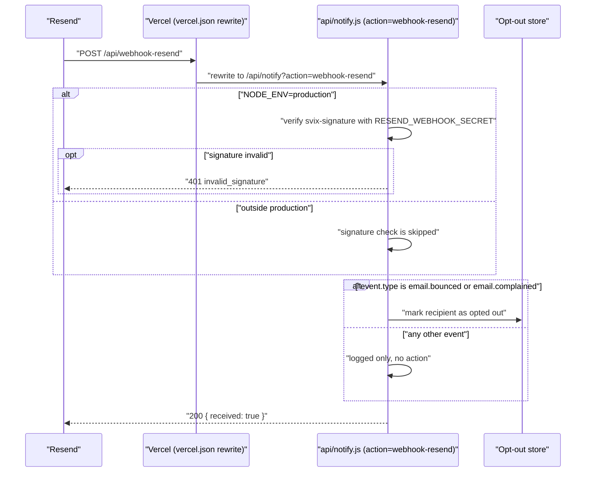

# Resend Email Service Setup - NikkeyBox

## Overview

NikkeyBox sends transactional email (order confirmations, account verification, password reset, cart recovery, payment review) through [Resend](https://resend.com), and receives delivery events back through a webhook. This guide documents the current code integration and how to finish wiring it up.

**Current state**: `RESEND_API_KEY` and `RESEND_WEBHOOK_SECRET` are not set in any Vercel environment (checked with `vercel env ls`). Until they are added, `sendMail()` fails with `email_service_not_configured` and the webhook has nothing to verify signatures against.

All outgoing email goes through one helper, `sendMail()` in `api/_lib/mailer.js`. The sender address is a hardcoded constant there, not an environment variable.

## Prerequisites

- ✅ Resend account created (https://resend.com)
- ✅ Domain verified in Resend dashboard
- ✅ NikkeyBox deployed on Vercel
- ✅ `resend` package installed (`npm install resend`)

## Environment Variables

| Variable | Used by | Status in Vercel | Notes |
|---|---|---|---|
| `RESEND_API_KEY` | `api/_lib/mailer.js` (`new Resend(...)`) | Not set | Without it, `sendMail()` throws `email_service_not_configured`. |
| `RESEND_WEBHOOK_SECRET` | `api/notify.js` (`verifyResendSignature`) | Not set | Needed in production to validate incoming webhook calls. |
| `SITE_ORIGIN` | `api/_lib/mailer.js` (`siteOrigin()`) | Not set, has a default | Defaults to `https://nikkeybox.jp`. Used to build the unsubscribe link. |

`.env.example` also lists `RESEND_FROM_EMAIL`, `RESEND_FROM_NAME` and `RESEND_REPLY_TO`, but no code in the project reads them. The sender address, reply-to and brand name are hardcoded constants (`MAIL_FROM`, `MAIL_REPLY_TO`, `BRAND`) at the top of `api/_lib/mailer.js` — edit that file, not an environment variable, to change them.

## Get a Resend API Key

### Via Vercel Marketplace (Recommended)
1. Go to https://vercel.com/marketplace/resend
2. Click "Add Integration"
3. Select your Vercel team and the NikkeyBox project
4. Authorize the integration
5. `RESEND_API_KEY` is added to your Vercel environment variables automatically

### Manual Setup
1. Log in to https://resend.com/api-keys
2. Click "Create API Key"
3. Name it (e.g. `nikkeybox-production`)
4. Copy the key (format: `re_xxxxxxxxxxxxx`) — do not share or commit it
5. Add it to the Vercel project: Project Settings → Environment Variables → `RESEND_API_KEY` (at least for Production)

## Configure Locally

Create `.env.local` in the project root:
```env
RESEND_API_KEY=re_your_api_key_here
```

## Webhook Setup

Resend posts delivery events to `/api/webhook-resend`. There is no standalone file for that route — `vercel.json` rewrites it to `/api/notify?action=webhook-resend`, handled by `handleWebhookResend` in `api/notify.js`.



### Create the webhook in the Resend dashboard
1. Go to https://resend.com/webhooks
2. Click "Create Webhook"
3. Endpoint URL: `https://nikkeybox.jp/api/webhook-resend` (default `SITE_ORIGIN`; use the actual deployment domain if different)
4. Select events:
- ✅ Email bounced
- ✅ Email complained
- Any other event (sent, delivered, opened, clicked...) is accepted and logged, but only bounced and complained trigger an action (automatic opt-out)
5. Copy the **Signing Secret** (format: `whsec_xxxxxxxxxxxxx`)

### Add the webhook secret to Vercel
1. Go to the Vercel project settings → Environment Variables
2. Add `RESEND_WEBHOOK_SECRET` with the signing secret from the step above
3. Redeploy

## How Signature Verification Works

`verifyResendSignature` (`api/notify.js`) reads the `svix-signature`, `svix-timestamp` and `svix-id` headers Resend sends (Resend delivers webhooks through Svix) and compares them against an HMAC computed with `RESEND_WEBHOOK_SECRET`.

Two details worth knowing:
- The check only runs when `NODE_ENV === 'production'`. Outside that (local dev, a preview deploy without that exact value), any payload is accepted.
- The HMAC is computed over `JSON.stringify(req.body)` — the body after Vercel's JSON parser — not the original request bytes.

## Sending Emails

`sendMail({ to, subject, html, unsubscribe })` (`api/_lib/mailer.js`) is the only way the project sends email. It is server-only — never import it from `src/` (the `@/` alias only resolves inside `src/`, and doing so would ship the Resend API key to the browser bundle).

```js
// from another file inside api/
import { sendMail, unsubscribeUrl } from './_lib/mailer.js';

await sendMail({
  to: 'customer@example.com',
  subject: 'Order confirmed',
  html: '<p>Your order has been confirmed.</p>',
  unsubscribe: unsubscribeUrl('customer@example.com'), // marketing email only
});
```

`sendMail` throws an error with a `code` and `statusCode` on failure: `email_service_not_configured` (503, missing `RESEND_API_KEY`), `email_validation_failed` (400), `email_send_failed` (503).

Real call sites: order confirmation (`api/stripe-webhook.js`, `api/orders.js`), payment-review notices (`api/_lib/fulfillment.js`), cart recovery (`api/cart-recovery.js`), account emails — verify/reset (`api/notify.js`), and custom-order notifications to the store (`api/public-forms.js`).

## Troubleshooting

### "API Key not found" / emails not sending
1. Verify `RESEND_API_KEY` is set (`.env.local` locally, Vercel env variable in production)
2. Restart the dev server after changing `.env.local`
3. Check the Resend dashboard logs for the actual error

### "invalid_signature" from the webhook
1. Confirm `RESEND_WEBHOOK_SECRET` in Vercel matches the signing secret shown in the Resend webhook settings
2. Remember the check is skipped outside `NODE_ENV=production` — a 401 only happens in production

### Webhook not receiving events
1. Confirm the endpoint URL in Resend matches the deployment exactly (`https://<domain>/api/webhook-resend`)
2. Check Vercel function logs for `[resend webhook]` entries
3. Resend can resend a specific past event from its dashboard for debugging

## Files

| File | Role |
|---|---|
| `api/_lib/mailer.js` | `sendMail()`, hardcoded sender (`MAIL_FROM`/`MAIL_REPLY_TO`/`BRAND`), `siteOrigin()`, `unsubscribeUrl()` |
| `api/notify.js` (`handleWebhookResend`) | Webhook handler: signature check, bounce/complaint opt-out |
| `vercel.json` | Rewrites `/api/webhook-resend` to `/api/notify?action=webhook-resend` |
| `.env.example` | Template for environment variables (includes a few that are unused — see above) |

## References

- Resend docs: https://resend.com/docs
- Resend webhooks: https://resend.com/docs/webhooks
- Vercel integration: https://vercel.com/marketplace/resend
