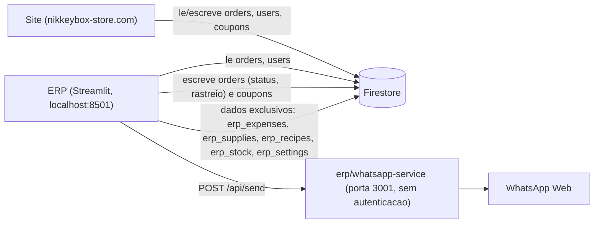

# 🏮 NikkeyBox — Sistema de Gestão (ERP)

Sistema profissional de gestão de vendas, estoque, despesas e clientes integrado ao Firebase do site NikkeyBox.

## 📦 Instalação

### 1. Instalar dependências
```bash
cd erp
pip install -r requirements.txt
```

### 2. Configurar Firebase (OBRIGATÓRIO)

1. Acesse o [Firebase Console](https://console.firebase.google.com/project/nikkey-33f93/settings/serviceaccounts/adminsdk)
2. Vá em **Configurações do Projeto** → **Contas de Serviço**
3. Clique em **"Gerar nova chave privada"**
4. Salve o arquivo `.json` baixado na pasta `erp/` — pode manter o nome original (qualquer `.json` com "firebase" ou "adminsdk" no nome funciona) ou renomear para `firebase-credentials.json`.

### 3. Executar
```bash
streamlit run app.py
```

O navegador abrirá automaticamente com o sistema em `http://localhost:8501`

## 🗂️ Funcionalidades

| Módulo | Descrição |
|--------|-----------|
| 📊 Dashboard | Visão geral com gráficos de vendas por mês, produto e categoria |
| 💰 Vendas Detalhadas | Análise completa com filtros por mês, produto e categoria + exportação Excel |
| 💸 Despesas | Registro de custos (ingredientes, potes, adesivos, frete, etc.) |
| 📋 Ficha Técnica | Custo exato de cada produto com cálculo automático de preço sugerido |
| 📦 Estoque | Controle de entrada/saída com alertas de estoque baixo |
| 👥 Clientes (CRM) | Clientes sincronizados do site + histórico de compras + sugestão de recompra |
| 📈 Resumo Financeiro | DRE completa (Bruto vs Líquido) + margem de contribuição por produto |
| 🛒 Lista de Compras | Lista automática baseada nas vendas + projeção de produção |
| 📦 Gestão de Pedidos | Kanban de pedidos por status — grava direto no Firestore (ver aviso abaixo) |
| 🏷️ Etiquetas de Envio | Gera etiqueta de envio em PDF para os pedidos |
| 🎟️ Cupons | Cria e remove cupons de desconto — mesma coleção `coupons` que o site usa |
| 🎂 Aniversários | Lista clientes com aniversário próximo para enviar cupom manualmente |
| 📱 WhatsApp | Envia mensagens pelo `erp/whatsapp-service` (local, porta 3001) |
| 📄 Relatórios | Exportação em Excel de qualquer dado do sistema |

## 📱 WhatsApp pelo ERP

O módulo WhatsApp do menu lateral conversa com `erp/whatsapp-service/` — um
servidor Node **separado** do `whatsapp-server/` da raiz do projeto (sessão
de WhatsApp Web própria, porta `3001`).

```bash
cd erp/whatsapp-service
npm install
node server.js
```

A URL da API (padrão `http://localhost:3001`, pode ser um túnel ngrok para
acessar de fora) fica salva em `erp_settings/whatsapp` no Firestore.

**Sem autenticação**: diferente do `whatsapp-server/` da raiz (que exige o
header `x-wa-token`), nenhuma rota de `erp/whatsapp-service` pede token —
`/api/send`, `/api/qrcode` e `/api/messages` respondem para qualquer
requisição que chegue na porta 3001. Se expuser essa porta na rede ou via
ngrok, trate a URL como sensível: qualquer um que a descubra pode enviar
mensagens como a loja, ler o histórico ou desconectar a sessão.

## 🔗 Integração com o Site



Lê do Firestore:
- Coleção `orders`: pedidos feitos no site
- Coleção `users`: clientes cadastrados no site

Escreve de volta no Firestore (afeta o site):
- `orders` — **Gestão de Pedidos** e **Etiquetas de Envio** mudam status e
  dados de rastreio direto no documento. Isso **não passa pela API do site**:
  o cliente não recebe o WhatsApp/e-mail automático que o painel admin do
  site dispara quando o status muda por lá.
- `coupons` — **Cupons** cria/edita/remove na mesma coleção que o site usa
  no checkout; não é um dado exclusivo do ERP.

Dados exclusivos do ERP (não afetam o site):
- `erp_expenses` — Despesas
- `erp_supplies` — Insumos/Ingredientes cadastrados
- `erp_recipes` — Fichas técnicas dos produtos
- `erp_stock` — Movimentações de estoque
- `erp_settings` — Configuração local do ERP (ex.: URL do WhatsApp)

## 💡 Dicas de Uso

1. **Primeiro passo**: Cadastre seus insumos na Ficha Técnica
2. **Segundo passo**: Monte a ficha técnica de cada produto
3. **Terceiro passo**: Registre suas despesas regularmente
4. **Resultado**: O Dashboard e o Resumo Financeiro calcularão tudo automaticamente

## 🌐 Acesso Remoto (Opcional)

Para acessar o sistema de qualquer lugar (ex: celular), suba o código em um
repositório privado no GitHub e conecte ao [Streamlit Cloud](https://streamlit.io/cloud)
— é gratuito! Nesse caso, o módulo WhatsApp não alcança seu `localhost:3001`
diretamente: seria preciso um túnel (ex.: ngrok) e configurar a URL em
**WhatsApp → Conexão** (ver aviso de autenticação acima).
