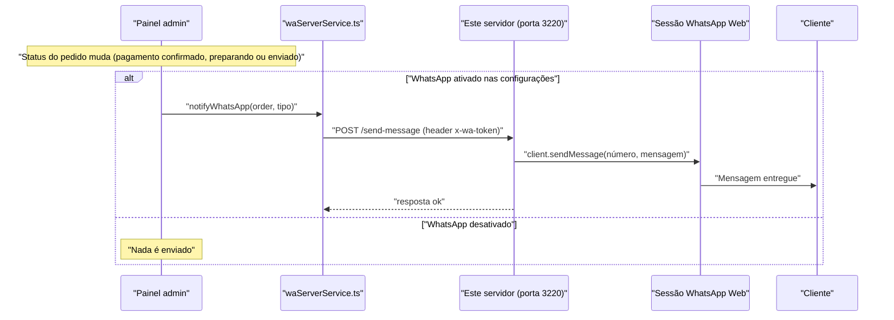
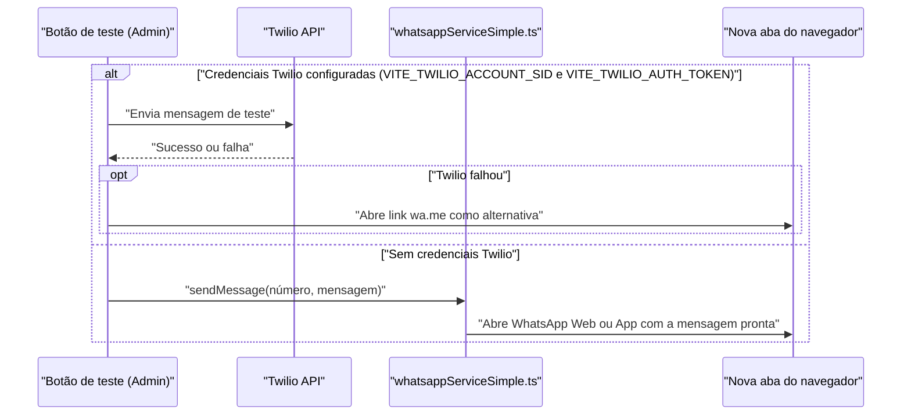

# NikkeyBox — Servidor de WhatsApp

Servidor local que envia mensagens automáticas de WhatsApp para os clientes
quando o status do pedido muda (pagamento confirmado, preparando ou enviado),
usando o número da loja.

## Como funciona

- Roda no PC do operador (mesmo que processa os pedidos).
- Mantém uma sessão do WhatsApp Web autenticada — você escaneia o QR **uma vez**
  e a sessão fica salva em `.wwebjs_auth/`. Nas próximas vezes conecta sozinho,
  **sem pedir QR de novo**.
- Quando o WhatsApp está **ativado** em Admin → Configurações → WhatsApp, o
  painel chama este servidor (`http://localhost:3220`) a cada mudança de
  status do pedido: pagamento confirmado, preparando ou enviado.
- Telefones sem código do país (11 dígitos ou menos) recebem o prefixo do
  Brasil (`55`) automaticamente antes do envio.

## Caminhos de envio do WhatsApp

O site tem **dois caminhos de teste** (só o botão de teste no painel admin)
e **um caminho real** (as notificações automáticas de pedido, acima). Este é
o único doc do projeto que descreve os três.

### Notificação real de pedido (usa este servidor)



### Botão de teste no admin (não usa este servidor)



O caminho de teste nunca notifica clientes reais - ele só roda quando alguém
clica em testar no painel admin.

## Instalação (uma vez)

```bash
cd whatsapp-server
npm install
```

## Iniciar

```bash
npm start
```

Na **primeira vez**, um QR code aparece no terminal. Escaneie com o WhatsApp da loja:

> WhatsApp → ⋮ (menu) → **Aparelhos conectados** → **Conectar um aparelho**

Também pode abrir `http://localhost:3220/qr` no navegador para ver o QR.

Depois de conectar, aparece `✅ Pronto!` e a sessão fica salva. Pode fechar o
terminal e reabrir com `npm start` — não pede QR de novo.

## Instalar como serviço (inicia no boot automaticamente)

Execute o script de instalação **uma única vez**:

```bash
bash install-service.sh
```

Ele instala o pm2, inicia o servidor e configura o startup. No final imprime
um comando para rodar com `sudo` — copie e execute para finalizar.

### Comandos úteis

```bash
pm2 status                  # ver se está rodando
pm2 logs japan-whatsapp     # logs em tempo real
pm2 restart japan-whatsapp  # reiniciar
pm2 stop japan-whatsapp     # parar
```

## Configurar no painel admin

No site: **Admin → Configurações → WhatsApp**
- Ativar: ✅
- URL do servidor: `http://localhost:3220`
- Token: o mesmo de `config.js` (`authToken`)

## ⚠️ Aviso importante

O `whatsapp-web.js` usa o WhatsApp Web de forma **não-oficial**. Use um número
**dedicado da loja** e envie **apenas mensagens transacionais** (status de pedido).
Enviar spam pode levar ao bloqueio do número pelo WhatsApp.

## Endpoints

Todas as rotas exigem o header `x-wa-token` com o mesmo valor de `authToken`
em `config.js`, exceto `/qr` (aberta direto no navegador, sem token).

| Método | Rota             | Corpo                | Descrição                                          |
|--------|------------------|-----------------------|------------------------------------------------------|
| GET    | `/health`        | -                     | `{ ok, ready, hasQr, version }`. Requer token.        |
| GET    | `/qr`            | -                     | Página HTML com o QR code para parear. Sem token.     |
| POST   | `/send-message`  | `{ phone, message }`  | Envia a mensagem. Requer token.                       |

Exemplo:

```bash
curl -X POST http://localhost:3220/send-message \
  -H "Content-Type: application/json" \
  -H "x-wa-token: SEU_TOKEN_AQUI" \
  -d '{"phone":"11999999999","message":"Teste"}'
```

Erros usam o campo `error` no corpo da resposta: `400` (telefone ou mensagem
ausente, ou telefone inválido), `401` (token errado), `404` (número sem
WhatsApp), `503` (sessão do WhatsApp ainda não conectada).
